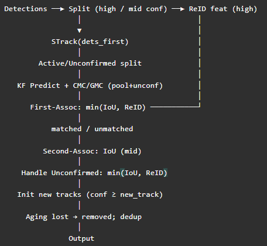
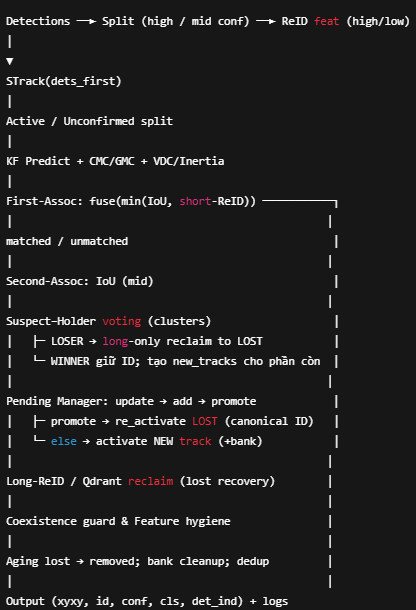

# Tracking + ReID System

## 1. Giới thiệu (Overview)
**Mục tiêu**: Xây dựng hệ thống **Tracking + ReID** nhằm phát hiện, theo dõi và nhận diện lại đối tượng trong video/camera.  

**Bối cảnh**: Ứng dụng trong giám sát an ninh, phát hiện xâm nhập và phân tích hành vi.  

**Điểm nổi bật**:
- Kết hợp **tracking** (BoT-SORT, DeepOCSort…) với **ReID** (OSNet, ArcFace, Qdrant long bank).  
- Cơ chế **Pending ID** và **Assign Manager** để xử lý trường hợp swap/switch ID.  
- Hỗ trợ **multi-camera** (nghiên cứu bước đầu).  

---

## 2. Kiến trúc hệ thống (System Architecture)
- **Detection**: YOLOv7 → sinh bounding box người.  
- **Tracking**: BoT-SORT (Kalman Filter + IoU + motion cues).  
- **ReID**:  
  - Short-term ReID (online features).  
  - Long-term ReID (Qdrant/HybridLongBank).
- **ID Management**:  
  - Pending Track (trì hoãn ID mới).  
  - Assign ID Manager (nghi ngờ hoán đổi, tái gán ID).  
- **Output**:  
  - Video + logs (ID, swap, suspect).  
  - Lưu vector ReID và metadata.  

👉 *Đính kèm sơ đồ pipeline sẽ giúp trực quan hơn.*  

---

## 3. Hướng dẫn cài đặt (Installation)
### Yêu cầu môi trường

### Yêu cầu môi trường
- Python 3.10.5  
- Conda (khuyến nghị để quản lý môi trường)  

### Các bước cài đặt
1. Clone repo:
```bash
git clone <repo_url>
```
2. Tạo môi trường
```bash
conda env create -f environment.yml
conda activate trackers_test
```

## 4. Luồng hoạt động (Pipeline workflow)

### Luồng gốc (boxmot/trackers/botsort/original/botsort.py)


### Luồng mới (boxmot/trackers/botsort/botsort_pending_idsd.py)


## 5. Cấu hình (Configs) boxmot/configs/trackers/botsort.yaml

## 6. Quickstart
```bash
python yolov7_track_pending.py
```